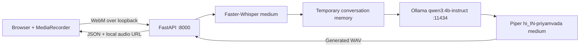

# Hindi Voice Agent

A local Windows prototype that records Hindi speech in a browser, transcribes it with Faster-Whisper, sends the text and temporary conversation history to a local Ollama Qwen3 model, synthesizes the reply with Piper or the optional isolated Indic Parler provider, and plays the WAV response in the browser. Typed Hindi/Hinglish/English chat uses the same per-tab conversation.

Everything is bound to `127.0.0.1` by the supplied scripts. No cloud API, database, authentication, streaming, or persistent conversation store is included.

## What it can do

- Record and replay microphone audio in the browser.
- Show a conservative Hindi transcript.
- Generate short local responses with `qwen3:4b-instruct`.
- Remember up to six completed turns per browser tab by default.
- Speak and replay the response with default Piper Hindi TTS or optional Indic Parler Divya/Rohit.
- Clear the current tab's conversation.
- Run fast mocked tests separately from real model-dependent integration tests.

## Architecture



See [docs/architecture.md](docs/architecture.md) for endpoint and lifecycle details.

## Stack and requirements

- Windows 10 or 11, PowerShell 5.1 or newer.
- 64-bit Python 3.11. Other Python versions are not part of the tested setup.
- FFmpeg available on `PATH`.
- Ollama and the local `qwen3:4b-instruct` model.
- A modern browser with `MediaRecorder` and microphone permission.
- Node.js only for frontend automated tests.
- CPU mode: about 16 GB RAM minimum; 24 GB is recommended for the medium Whisper model plus Ollama.
- Optional GPU STT: an NVIDIA GPU with sufficient VRAM, a compatible driver, CUDA 12 cuBLAS, and cuDNN 9. CPU mode remains the safe default.

## First-time setup

Run these commands in PowerShell from any parent directory:

```powershell
Set-Location .\hindi-voice-agent
py -3.11 -m venv .venv
.\.venv\Scripts\python.exe -m pip install --upgrade pip
.\.venv\Scripts\python.exe -m pip install -r .\backend\requirements.txt
Copy-Item .\.env.example .\.env
```

Install [FFmpeg](https://ffmpeg.org/download.html) and [Ollama](https://ollama.com/download/windows), ensure both commands are on `PATH`, then obtain the models:

```powershell
ollama pull qwen3:4b-instruct
.\.venv\Scripts\python.exe -m piper.download_voices hi_IN-priyamvada-medium --download-dir .\backend\models\piper
```

The Piper command downloads both `hi_IN-priyamvada-medium.onnx` and `hi_IN-priyamvada-medium.onnx.json`. The voice files are intentionally ignored by Git because this selected voice's model card identifies its dataset licence as **CC BY-NC-SA 4.0**. Review [docs/licenses.md](docs/licenses.md) before redistributing or using it.

Optional Indic Parler setup is isolated from the stable environment:

```powershell
powershell -ExecutionPolicy Bypass -File .\scripts\install_indic_parler.ps1
Start-Process https://huggingface.co/ai4bharat/indic-parler-tts
& .\.venv-indic-parler\Scripts\hf.exe auth login
```

Accept the gated model terms in the opened page before authenticating. No model file, token, virtual environment, or generated WAV belongs in Git.

Validate the machine without installing or changing anything:

```powershell
Set-Location .\hindi-voice-agent
powershell -ExecutionPolicy Bypass -File .\scripts\check_setup.ps1
```

The checker reports `PASS`, `WARNING`, and `FAIL` for Python, imports, FFmpeg, Ollama/model, Piper files, output permissions, Whisper settings, CUDA detection, and ports 8000/5500/11434.

Detailed setup and clean-room notes are in [docs/setup.md](docs/setup.md).

## Configuration

Copy `.env.example` to `.env` and edit only local values. `.env` is ignored by Git. The PowerShell scripts parse it directly, so `python-dotenv` is not needed. A variable already set in the current PowerShell process takes precedence over `.env`; application defaults apply when neither exists.

CPU STT defaults:

```text
WHISPER_MODEL=medium
WHISPER_DEVICE=cpu
WHISPER_COMPUTE_TYPE=int8
WHISPER_ALLOW_CPU_FALLBACK=true
```

Optional NVIDIA GPU STT:

```powershell
$env:WHISPER_DEVICE = "cuda"
$env:WHISPER_COMPUTE_TYPE = "float16"
$env:WHISPER_ALLOW_CPU_FALLBACK = "false"
.\scripts\start_backend.ps1
```

Faster-Whisper currently requires CUDA 12 cuBLAS and cuDNN 9 for current CTranslate2 releases. Run `check_setup.ps1`, then prove GPU use with an actual transcription and `nvidia-smi`; a nonzero CUDA device count alone is not proof of inference. Never hardcode CUDA DLL directories in source.

Return safely to CPU mode by closing the backend, removing the temporary `$env:` overrides (or opening a new PowerShell), keeping the CPU values in `.env`, and starting the backend again.

## Start and stop

One command checks prerequisites and opens separate local service windows when needed:

```powershell
Set-Location .\hindi-voice-agent
powershell -ExecutionPolicy Bypass -File .\scripts\start_all.ps1
```

Open <http://127.0.0.1:5500/>. To stop safely, press `Ctrl+C` in each backend, frontend, and Ollama window that `start_all.ps1` opened, then close those windows. The script does not stop or replace a service that was already running.

To start components in separate terminals instead:

```powershell
# Terminal 1 (start Ollama only if it is not already running)
ollama serve

# Terminal 2 (optional natural voice worker)
Set-Location .\hindi-voice-agent
powershell -ExecutionPolicy Bypass -File .\scripts\start_indic_parler.ps1

# Terminal 3
Set-Location .\hindi-voice-agent
powershell -ExecutionPolicy Bypass -File .\scripts\start_backend.ps1

# Terminal 4
Set-Location .\hindi-voice-agent
powershell -ExecutionPolicy Bypass -File .\scripts\start_frontend.ps1
```

All supplied servers bind only to `127.0.0.1`.

## Use

1. Open the frontend and allow microphone access.
2. Select **Start Recording**, speak Hindi, then stop.
3. Select **Transcribe Recording** for STT only, or **Ask Voice Agent** for the complete STT → LLM → TTS flow.
4. If browser autoplay is blocked, select **Play Response**. Use **Replay Response** to hear it again.
5. Typed chat shares the same temporary tab session. **New Conversation** clears that server-side session and rotates the tab identifier.

Conversation data is process-local and temporary. A backend restart clears all memory. Audio bytes are never stored in conversation memory. Upload files are deleted after each request. Generated response WAVs are automatically removed by age and file-count limits (60 minutes and 50 files by default).

## Tests

Fast syntax, unit, frontend, and dependency checks do not load or download models:

```powershell
Set-Location .\hindi-voice-agent
powershell -ExecutionPolicy Bypass -File .\scripts\run_tests.ps1
```

Real integration tests require running local services and a real `.webm` recording under `backend\temporary_audio`:

```powershell
Set-Location .\hindi-voice-agent
New-Item -ItemType Directory -Force .\backend\temporary_audio
# Copy your own test recording into .\backend\temporary_audio\
powershell -ExecutionPolicy Bypass -File .\scripts\run_tests.ps1 -Integration
```

See [docs/testing.md](docs/testing.md) for the exact test split and expected side effects.

## Health and diagnostics

`GET http://127.0.0.1:8000/api/health` validates configuration, checks the local Ollama model list, and verifies Piper files. It does not load or run Whisper, Qwen, or Piper and never returns paths, secrets, stack traces, or conversation history. A response may be `degraded` while the API process itself remains reachable.

Use `scripts/check_setup.ps1` for detailed local diagnostics. It is read-only and intentionally not exposed as an HTTP endpoint.

## Privacy and limitations

The browser sends recordings and chat text over local loopback to FastAPI. FastAPI contacts the configured loopback Ollama server. Temporary upload files are deleted after processing; generated WAVs remain briefly on disk until cleanup. Conversation text stays in backend memory until clear, expiry, eviction, or restart. Browser session storage keeps only a random session ID. See [docs/privacy.md](docs/privacy.md); this architecture reduces external transfer but is not an absolute privacy guarantee.

Current limitations include no authentication, multi-user isolation beyond random session IDs, persistence, streaming, WebSockets, cloud deployment, mobile/phone integration, or production hardening. Hindi/Hinglish transcription quality varies with accent, microphone quality, background noise, code-switching, and Whisper model behavior; the conservative cleanup rules correct only a few known phrases. `qwen3:4b-instruct` can produce incorrect, awkward, mixed-language, or unsupported Hindi answers. The app is intended for local development only.

## Troubleshooting

- Run `scripts/check_setup.ps1` first.
- If a port is occupied by an unexpected service, identify it; the scripts will not kill it.
- If Ollama is unavailable, start `ollama serve` and verify `ollama list` includes `qwen3:4b-instruct`.
- If Piper is missing, rerun the documented voice download command.
- If CUDA initialization fails, switch back to CPU `int8` and check CUDA 12 cuBLAS/cuDNN 9 compatibility.
- If the microphone is blocked, use `http://127.0.0.1:5500/`, grant browser permission, and ensure another app is not holding the device.

More cases are in [docs/troubleshooting.md](docs/troubleshooting.md).

## Licence and sharing warning

This repository currently has **no project-level source-code licence selected**. Possession of the files does not itself grant redistribution or reuse rights; the owner must add an appropriate `LICENSE` before public distribution. Third-party software and models retain their own terms. Most importantly, the selected `hi_IN-priyamvada-medium` voice identifies CC BY-NC-SA 4.0 dataset terms, including non-commercial and share-alike restrictions. This is not legal advice; verify terms for the intended use.

Before sharing, exclude `.venv`, `.env`, model binaries, temporary recordings and their transcripts, generated WAVs, logs, caches, and Ollama storage. Give the recipient the source plus `.env.example`, `backend/requirements.txt`, scripts, and docs; they must install dependencies and download models themselves. See [docs/licenses.md](docs/licenses.md) and [docs/setup.md](docs/setup.md).

## Documentation

- [Architecture](docs/architecture.md)
- [Setup and sharing](docs/setup.md)
- [Testing](docs/testing.md)
- [Troubleshooting](docs/troubleshooting.md)
- [Privacy](docs/privacy.md)
- [Licences](docs/licenses.md)
- [Milestone progress](docs/progress.md)
